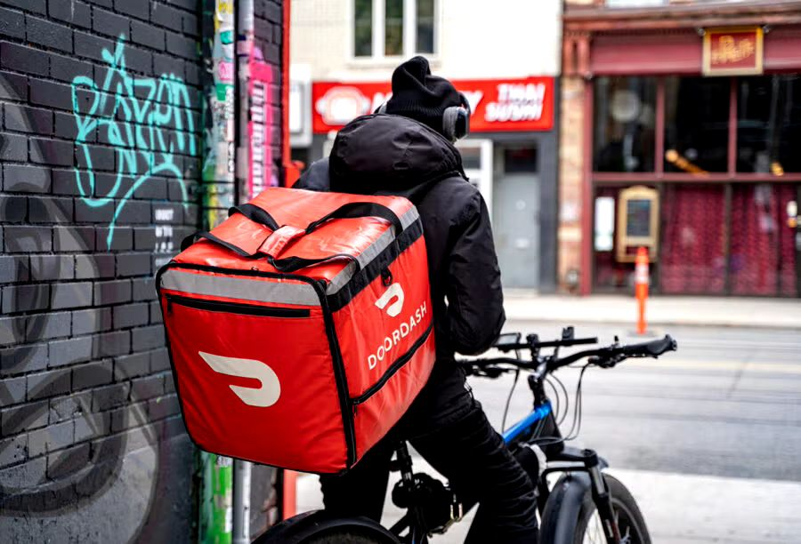

# Delivery-Duration-Prediction
When a consumer places an order on DoorDash, we show the expected time of delivery. It is very important for DoorDash to get this right, as it has a big impact on consumer experience. In this project, I'm building a model to predict the estimated time taken for a delivery.

